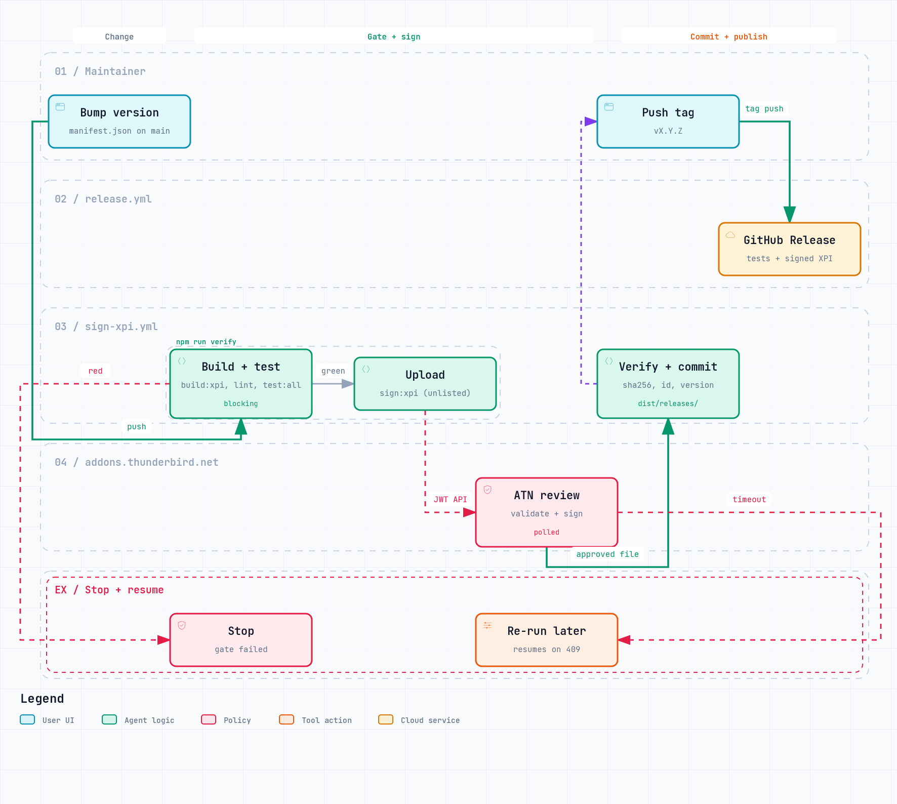

# AGENTS.md — Thunderbird CLI Enhanced

> Repo guide for AI coding agents working **in this codebase** (Cursor, Cline, Codex CLI, Claude Code, Windsurf, Aider, etc.).
>
> Looking for the **end-user** skill that teaches Claude how to *use* this tool? That's in [`skills/thunderbird-cli/`](./skills/thunderbird-cli/). This file is about working *on* the code.

## What this repo ships

Four artifacts, one architecture. The npm names below are upstream's published packages; this fork doesn't publish to them, so users install from source (`setup.sh` / `setup.ps1`).

| Artifact | What | Where |
|---|---|---|
| `thunderbird-cli` | `tb` CLI (41 commands) | `cli/` → npm: `thunderbird-cli` |
| `thunderbird-cli-bridge` | Stateless HTTP↔WS proxy daemon | `bridge/` → npm: `thunderbird-cli-bridge` |
| `thunderbird-cli-mcp` | MCP server (13 tools for Claude Desktop) | `mcp/` → npm: `thunderbird-cli-mcp` |
| Thunderbird WebExtension | WS client inside Thunderbird | `extension/` → Mozilla-signed (unlisted) XPI in `dist/releases/` |

```
AI Agent ─→ tb CLI      ─┐
                          ├─→ bridge daemon ─→ Thunderbird WebExtension ─→ messenger.* APIs → your accounts
Claude   ─→ tb-mcp MCP   ─┘      HTTP :7700          WebSocket :7701
```

Everything localhost-only. Thunderbird holds credentials; no creds pass through the agent.

## Setup (before editing)

```bash
npm install                # installs workspace deps for cli/, bridge/, mcp/
npm test                   # 46 CLI/bridge integration tests
npm run test:mcp           # 34 MCP server tests
npm run bridge             # start bridge (needed for live tests; not for unit tests)
```

Node 20+ required. All three packages are ES modules (`"type": "module"`).

## Conventions you need to follow

### Code style

- **ES modules** throughout, `"type": "module"` in every `package.json`.
- **CLI framework:** `commander.js`. Command definitions in `cli/src/cli.js`; HTTP client + formatters in `cli/src/client.js`.
- **Bridge:** vanilla Node `http` + `ws`. Zero business logic — it's a UUID-correlated proxy. Don't add state.
- **MCP server:** `@modelcontextprotocol/sdk`. Stdio transport. Reuses `cli/src/client.js` — don't re-implement the HTTP client in `mcp/`.
- **Extension:** pure WebExtension (`manifest_version: 2`). No Experiment APIs. Compatible with Thunderbird 128+.

### Output format

By default every command outputs atomic JSON (`--output-version 2` / `TB_OUTPUT_VERSION=2` opts into a leaner shape; see `SPEC.md` → Output Format — keep v1 the default):

```json
{ "ok": true,  "data": { ... } }
{ "ok": false, "error": "message", "code": "ERROR_CODE" }
```

Error codes: `BRIDGE_UNREACHABLE`, `EXTENSION_DISCONNECTED`, `AUTH_REQUIRED`, `FORBIDDEN`, `TIMEOUT`, `NOT_FOUND`, `INVALID_ARGS`, `THUNDERBIRD_ERROR`, `EVENT_TIMEOUT`, `RECONNECT_TIMEOUT`. Don't invent new ones — pick an existing one or extend the union intentionally.

### Safety defaults (NEVER weaken)

These are defaults the end-user agent relies on. Don't flip them:

- `email_search` excludes junk unless `include_junk: true` is explicit
- `email_compose` / `email_reply` / `email_forward` default to `mode: "draft"`
- `email_archive operation=delete` requires `permanent=true` AND `confirm=true` for permanent deletion
- CLI bulk ops (`tb bulk delete`, `tb folder-delete`) require `--confirm`

See `SECURITY.md` for the full threat model.

### Token efficiency

The MCP + CLI both support:

- `fields` (MCP) / `--fields` (CLI): comma-separated allowlist of keys in the response
- `compact` (MCP) / `--compact` (CLI): strip `null` values
- `max_body` (MCP) / `--max-body` (CLI): truncate message bodies

If you add a new tool or command that returns structured data, support these three options. They're the difference between an agent fitting 50 results in context vs. 5.

### Commit style

Conventional commits. Short form:

- `feat(scope): ...` — new capability
- `fix(scope): ...` — bug fix
- `docs: ...` — docs-only
- `chore: ...` — metadata / tooling
- `test(scope): ...` — test-only

Scopes: `cli`, `bridge`, `mcp`, `extension`, `docker`, `meta`, `release`.

### Version bumps

All four `package.json` files (`package.json`, `cli/package.json`, `bridge/package.json`, `mcp/package.json`) move together. `server.json` (for the MCP Registry) must match the package version. Update `CHANGELOG.md` in the same commit.

## Tests before pushing

```bash
npm run test:all
```

`prepublishOnly` enforces this at publish time, but run it locally first — it'll save you a failed CI cycle. CI runs on Node 20 + 22.

## Before opening a PR

- [ ] All four `package.json` files match versions if you bumped
- [ ] `server.json` version matches (when bumping)
- [ ] `CHANGELOG.md` has an entry
- [ ] New CLI command? → add a test in `test/quick-test.mjs`
- [ ] New MCP tool? → add a test in `test/mcp-test.mjs` and register it in `mcp/src/tools.js`
- [ ] New error code? → document it in `SPEC.md`
- [ ] New destructive op? → gate it behind `--confirm` / `confirm: true`
- [ ] New extension route? → classify it in `extension/src/access-control.js` (unclassified routes fail closed with `FORBIDDEN`)
- [ ] New or changed `tb` command/flag? → update `docs/COMMANDS.md` (`npm run test:docs` checks it against `tb --help`)
- [ ] Changed architecture, request flow, access policy, release flow or roadmap? → update `docs/diagrams/src/*.json` and run `npm run build:diagrams` (see `CONTRIBUTING.md`)
- [ ] Did you change the MCP tool surface? → update [`skills/thunderbird-cli/SKILL.md`](./skills/thunderbird-cli/SKILL.md) so the end-user skill stays accurate

## Release

<a href="docs/diagrams/release-workflow.html"><picture>
  <source media="(prefers-color-scheme: dark)" srcset="docs/diagrams/release-workflow-dark.png">
  
</picture></a>

Tagging `vX.Y.Z` fires `.github/workflows/release.yml`:

1. Runs `npm run test:all`
2. Builds the unsigned XPI
3. Finds the signed XPI in `dist/releases/` (must be checked in)
4. Creates the GitHub Release with both XPIs attached

The signed XPI itself comes from `.github/workflows/sign-xpi.yml`: bumping `version` in `extension/manifest.json` on `main` runs `npm run verify`, signs through the addons.thunderbird.net API (`npm run sign:xpi`, secrets `MOZILLA_HUB_JWT_ISSUER` / `MOZILLA_HUB_JWT_SECRET`) and commits `dist/releases/<name>-<version>-tb.xpi`. Tag after that commit lands.

npm publish is manual (`cd cli && npm publish`) — intentionally, so a release tag without publish is a no-op you can recover from.

## Key files to know

| File | What's in it |
|---|---|
| `SPEC.md` | Full technical specification — source of truth for tool surface |
| `SECURITY.md` | Threat model, CLI defenses, agent patterns |
| `docs/SETUP.md` | User install guide |
| `docs/COMMANDS.md` | All 41 CLI commands reference |
| `docs/CLAUDE.md` | Claude Code–focused CLI quick-ref (end-user oriented) |
| `docs/distribution-log.md` | Launch venue submission tracker |
| `skills/thunderbird-cli/SKILL.md` | End-user Claude skill (separate from this file) |
| `CONTRIBUTING.md` | Local dev setup, PR process |

## Non-goals

Don't propose these without discussing first:

- **Server-side filtering logic.** Thunderbird is source of truth; we don't reimplement IMAP filter semantics.
- **Cloud deployment.** Bridge is localhost-only by design. No remote auth, no TLS, no tunnels.
- **New credential flow.** We never touch user email credentials. If a feature needs OAuth, it doesn't belong here.
- **Breaking the CLI ↔ MCP symmetry.** CLI is the superset (38 cmds); MCP is the curated 12-tool subset. When adding a bulk op, CLI-only is the correct choice — don't expose it as an MCP tool unless it's individually-scoped.

## Questions / weirdness

Check `SPEC.md` first. If it's not there, open an issue — don't guess at behavior from the WebExtension side. Thunderbird's `messenger.*` API has sharp edges (async races, provider-specific IMAP quirks, Gmail's label-not-folder model) that are documented in `SPEC.md` as we discover them.
