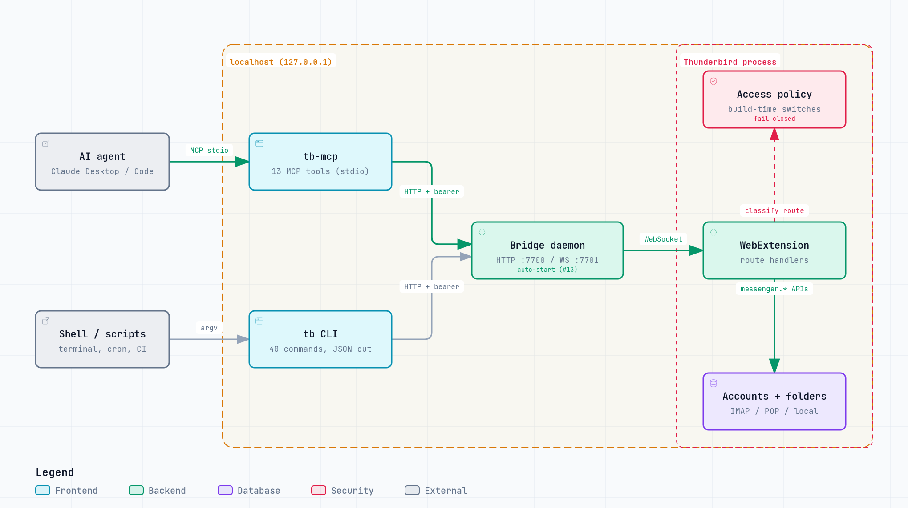
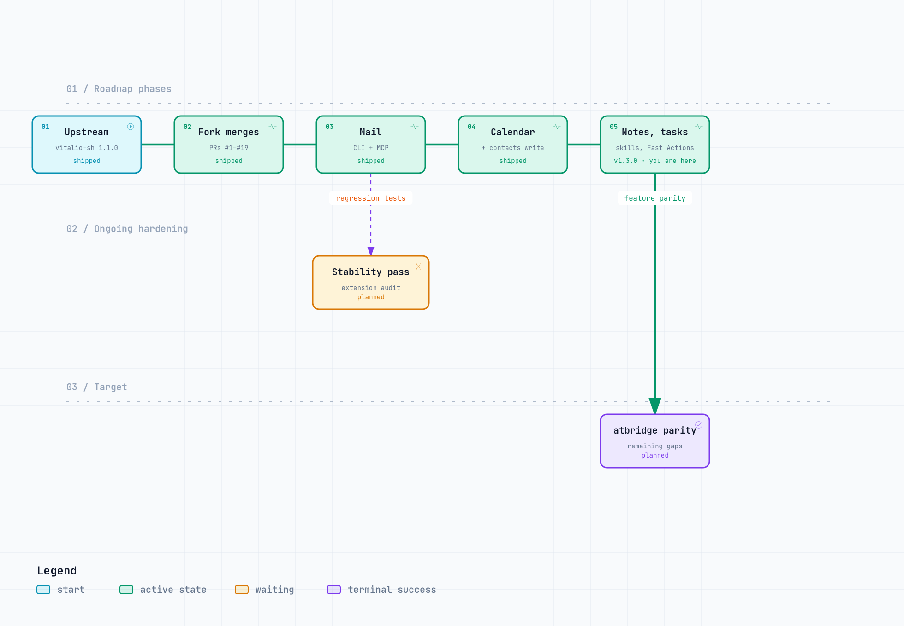

# Thunderbird CLI Enhanced

> Give Claude (and other AI agents) full access to your email through Mozilla Thunderbird, with an installation-wide access policy that decides what they may change.

[](https://github.com/odience-network/thunderbird-cli-enhanced/actions/workflows/test.yml)

[](https://www.npmjs.com/package/@odience-network/thunderbird-cli-enhanced)
[](LICENSE)
[](https://nodejs.org)
[](https://www.thunderbird.net)
[](https://modelcontextprotocol.io)

This is a maintained fork of [vitalio-sh/thunderbird-cli](https://github.com/vitalio-sh/thunderbird-cli). It integrates fixes and features from the community forks listed under [Why this fork](#why-this-fork) and adds an access policy, a signed-XPI release pipeline, and draft editing.

<p align="center">
  
</p>

## Why

IMAP libraries force you to manage credentials, OAuth flows, and sync state — dangerous in an AI-agent context. **Thunderbird already solves all of that.** This tool treats Thunderbird as the source of truth and exposes every capability as a CLI command or MCP tool, so AI agents can read, search, and write email without ever touching a password.

## Features

- 🔐 **Zero credential exposure** — all IMAP/SMTP stays in Thunderbird
- 🤖 **Claude Desktop ready** — 16 MCP tools, one-line config
- 📨 **43 CLI commands** — read, search, compose, reply, edit drafts, bulk ops, folder CRUD, attachments, contacts (read/write)
- 🛡️ **Access policy** — one policy baked into the add-on gates every write/send route for CLI, MCP and raw bridge calls; deletion is off by default and unknown routes fail closed ([docs/ACCESS-CONTROL.md](docs/ACCESS-CONTROL.md))
- ✉️ **Safe by default** — compose/reply/forward/edit save as drafts; permanent delete requires `--confirm`
- 🚀 **Bridge auto-start** — the CLI and MCP server start the bridge daemon on first use
- 🎯 **Token-optimized** — `--fields` selection, `--compact` mode, `--max-body` truncation, `-f json|compact|table`, opt-in leaner output with `--output-version 2`
- ⚡ **Fast on large folders** — server-side full-text query, sort (TB 148+), indexed `--unread`/`--flagged` plus date/size/tag filtering, `--subject`/`--from` search
- 🏠 **Localhost-only** — no cloud, no telemetry, nothing leaves your machine
- ✅ **Thunderbird 128+** — Mozilla-signed XPI built and signed by CI ([dist/releases/](dist/releases/))
- 🧪 **Tested** — `npm run test:all` runs the CLI/bridge, bridge security, extension, access-control, signing and MCP suites

## Quick Start

Install the CLI, bridge and MCP server from npm (Node.js 20+):

```bash
npm i -g @odience-network/thunderbird-cli-enhanced   # gives you tb, tb-bridge and tb-mcp
```

> **Coming from upstream `thunderbird-cli`?** The unscoped npm packages `thunderbird-cli`, `thunderbird-cli-bridge` and `thunderbird-cli-mcp` are upstream's and don't contain this fork's changes. They install the same `tb`, `tb-bridge` and `tb-mcp` commands, so remove them first:
> `npm uninstall -g thunderbird-cli thunderbird-cli-bridge thunderbird-cli-mcp` (and `npm unlink -g` any source checkouts you linked).

Or install from source, which links the same three commands:

```bash
git clone https://github.com/odience-network/thunderbird-cli-enhanced
cd thunderbird-cli-enhanced

./setup.sh       # macOS / Linux
.\setup.ps1      # Windows (PowerShell)
```

Then:

1. Install the signed extension from [`dist/releases/`](dist/releases/): Thunderbird → Add-ons → ⚙ → **Install Add-on From File…** → the `*-tb.xpi` file. The signed 2.1.0 build predates the rename and still shows as "Thunderbird AI Bridge" in the Add-ons Manager.
2. Try it — the bridge starts automatically on first use:

   ```bash
   tb health
   tb stats
   ```

Full setup guide (background service, Docker, access policy, troubleshooting): **[docs/SETUP.md](docs/SETUP.md)**

## Usage

```bash
# How many unread across all accounts?
tb stats

# Find invoices from AWS in the last 30 days
tb search "invoice" --from aws --since 30d --fields id,author,subject,date

# Read a message (token-efficient — headers + text only, max 500 chars)
tb read 89900 --max-body 500

# Reply as draft (never auto-sends)
tb reply 89900 --body "Thanks, I'll review tomorrow"

# Edit an existing draft (messageId may change after save)
tb edit 12001 --body "Revised body — please review"

# Download a PDF attachment
tb attachment-download 11 1.2 --output invoice.pdf

# Bulk archive old newsletters
tb bulk move "account1://INBOX" "account1://Archive" \
  --from "newsletter@" --older-than 30
```

Full command reference: **[docs/COMMANDS.md](docs/COMMANDS.md)**

## Use with Claude Desktop

Add to your Claude Desktop config (`~/Library/Application Support/Claude/claude_desktop_config.json` on macOS). `npx` fetches the package on demand, no global install needed:

```json
{
  "mcpServers": {
    "thunderbird": {
      "command": "npx",
      "args": ["-y", "-p", "@odience-network/thunderbird-cli-enhanced", "tb-mcp"]
    }
  }
}
```

With a global install (`npm i -g`) or the setup script, `"command": "tb-mcp"` with no `args` works too. For Claude Code:

```bash
claude mcp add thunderbird -- npx -y -p @odience-network/thunderbird-cli-enhanced tb-mcp
```

Restart Claude Desktop. Now ask:

> *"How many unread emails do I have?"*
> *"Find invoices from AWS last month"*
> *"Reply to message 118 saying I'll attend — save as draft"*
> *"Download the PDF attachment from message 245"*

Full MCP guide: **[mcp/README.md](mcp/README.md)**

### Companion skill for Claude

A [Claude Skill](https://agentskills.io) ships alongside the MCP server. It teaches Claude *how to use* the 16 email tools well — token-efficient field selection, draft-by-default safety, checking trust signals before acting on links, recipes for common workflows. Install it from **[`skills/thunderbird-cli/`](skills/thunderbird-cli/)**:

```bash
# Claude Code
cp -r skills/thunderbird-cli ~/.claude/skills/
# ...or from the npm install
cp -r "$(npm root -g)/@odience-network/thunderbird-cli-enhanced/skills/thunderbird-cli" ~/.claude/skills/

# Claude.ai — zip and upload via Settings → Capabilities → Skills
cd skills && zip -r thunderbird-cli.zip thunderbird-cli
```

Without the skill, the MCP still works. With it, Claude automatically uses the safest defaults and most efficient response shapes.

## How It Works

<p align="center">
  <a href="docs/diagrams/architecture.html">
    <picture>
      <source media="(prefers-color-scheme: dark)" srcset="docs/diagrams/architecture-dark.png">
      
    </picture>
  </a>
  <br><sub>Click for the interactive version. More diagrams: <a href="docs/diagrams/">docs/diagrams/</a></sub>
</p>

| Component | Role |
|---|---|
| **Extension** (`extension/`) | Thunderbird WebExtension. Calls `messenger.*` APIs; every route is classified by the access policy. |
| **Bridge** (`bridge/`) | HTTP↔WebSocket proxy daemon on `127.0.0.1:7700`/`7701`. No business logic; buffers recent extension events for long-polling. |
| **CLI** (`cli/`) | `tb` command — 43 commands. Thin HTTP client. JSON output. |
| **MCP** (`mcp/`) | `tb-mcp` server — 16 curated tools for Claude Desktop. |

Thunderbird is the source of truth. The CLI never caches or stores email data.

## Why this fork

Upstream baseline is [vitalio-sh/thunderbird-cli@`465613d`](https://github.com/vitalio-sh/thunderbird-cli/commit/465613d) (1.1.0). Each row below is merged on `main` and linked to the PR that landed it. Planned work is listed separately under [Roadmap](#roadmap).

| Feature | Enhanced | Upstream | Origin | Landed in |
|---|:-:|:-:|---|---|
| Access policy for every write/send route, fail-closed on unknown routes | ✅ | ❌ | [reinhardullrich](https://github.com/reinhardullrich/thunderbird-cli) (`93178cb`), extended | [#6](https://github.com/odience-network/thunderbird-cli-enhanced/pull/6) |
| Deletion disabled unless the policy enables it | ✅ | ❌ | [reinhardullrich](https://github.com/reinhardullrich/thunderbird-cli) (`b5b7714`), modified | [#4](https://github.com/odience-network/thunderbird-cli-enhanced/pull/4) |
| Filters applied before `--limit`; accurate `hasMore` | ✅ | ❌ | [reinhardullrich](https://github.com/reinhardullrich/thunderbird-cli) | [#2](https://github.com/odience-network/thunderbird-cli-enhanced/pull/2) |
| Reply keeps the receiving identity and the quoted body | ✅ | ❌ | [bfg1981](https://github.com/bfg1981/thunderbird-cli) | [#1](https://github.com/odience-network/thunderbird-cli-enhanced/pull/1) |
| Conversation history on reply/forward, `--no-history` | ✅ | ❌ | [inrainbws](https://github.com/inrainbws/thunderbird-cli) | [#3](https://github.com/odience-network/thunderbird-cli-enhanced/pull/3) |
| Folder-info cache for `list`/`stats`, MCP concurrency tests, live smoke scripts | ✅ | ❌ | [le-dawg](https://github.com/le-dawg/thunderbird-cli) | [#8](https://github.com/odience-network/thunderbird-cli-enhanced/pull/8) |
| One-command setup scripts (`setup.sh`, `setup.ps1`) | ✅ | ❌ | [KaiSingL](https://github.com/KaiSingL/thunderbird-cli) | [#9](https://github.com/odience-network/thunderbird-cli-enhanced/pull/9) |
| Attachment extension inference, general-query and empty-query search, recipient parsing | ✅ | ❌ | [KaiSingL](https://github.com/KaiSingL/thunderbird-cli) | [#11](https://github.com/odience-network/thunderbird-cli-enhanced/pull/11) |
| `--keep-unread` on `delete`/`archive` | ✅ | ❌ | [KaiSingL](https://github.com/KaiSingL/thunderbird-cli) | [#12](https://github.com/odience-network/thunderbird-cli-enhanced/pull/12) |
| Bridge auto-start from CLI and MCP | ✅ | ❌ | [KaiSingL](https://github.com/KaiSingL/thunderbird-cli) | [#13](https://github.com/odience-network/thunderbird-cli-enhanced/pull/13) |
| Server-side sort, filters and full-text query | ✅ | ❌ | [KaiSingL](https://github.com/KaiSingL/thunderbird-cli) | [#14](https://github.com/odience-network/thunderbird-cli-enhanced/pull/14) |
| Edit existing drafts (`tb edit`, MCP `email_edit`) | ✅ | ❌ | [KaiSingL](https://github.com/KaiSingL/thunderbird-cli) | [#15](https://github.com/odience-network/thunderbird-cli-enhanced/pull/15) |
| Extension icons and toolbar connection-status indicator | ✅ | ❌ | [KaiSingL](https://github.com/KaiSingL/thunderbird-cli) | [#16](https://github.com/odience-network/thunderbird-cli-enhanced/pull/16) |
| `tb extension-reload` and the `/bridge/events` long-poll feed | ✅ | ❌ | [KaiSingL](https://github.com/KaiSingL/thunderbird-cli) (`0b3a5d7`) | [#17](https://github.com/odience-network/thunderbird-cli-enhanced/pull/17) |
| Opt-in v2 output: TTY tables, no envelope, short field presets (`--output-version 2`) | ✅ | ❌ | [KaiSingL](https://github.com/KaiSingL/thunderbird-cli), made opt-in | [#19](https://github.com/odience-network/thunderbird-cli-enhanced/pull/19) |
| CI builds, lints, tests and Mozilla-signs the XPI | ✅ | ❌ | this fork | [#5](https://github.com/odience-network/thunderbird-cli-enhanced/pull/5), [#7](https://github.com/odience-network/thunderbird-cli-enhanced/pull/7) |
| Bridge enforces `TB_AUTH_TOKEN` | ✅ | ✅ | [jctots](https://github.com/jctots/thunderbird-cli) | upstream [`a052c8d`](https://github.com/odience-network/thunderbird-cli-enhanced/commit/a052c8d) |
| `--account` filtering for `recent`/`thread`, accountId inside pagination | ✅ | ✅ | [dboeckenhoff](https://github.com/dboeckenhoff/thunderbird-cli) (equivalent fix already upstream) | verified in [`54cd46d`](https://github.com/odience-network/thunderbird-cli-enhanced/commit/54cd46d) |

<details>
<summary>How one search travels through the system (#13, #14)</summary>

<a href="docs/diagrams/search-sequence.html"><picture>
  <source media="(prefers-color-scheme: dark)" srcset="docs/diagrams/search-sequence-dark.png">
  
</picture></a>

</details>

## Roadmap

Planned, **not on `main`**:

- Calendar events/tasks CRUD, contacts write, notes and tasks, toward feature parity with [atbridge.ai](https://atbridge.ai). A read-only calendar-listing spike (`tb calendars`) landed first, using a chrome-privileged Experiment API since Thunderbird's WebExtension model has no calendar access — see [docs/decisions/calendar-backend.md](docs/decisions/calendar-backend.md) for the tradeoffs, including why this currently keeps calendar support off the signed-XPI release track.
- Extension stability pass: audit against the known reconnect/backoff and lifecycle fixes, with regression tests.

<a href="docs/diagrams/roadmap.html"><picture>
  <source media="(prefers-color-scheme: dark)" srcset="docs/diagrams/roadmap-dark.png">
  
</picture></a>

Details and status: [docs/PLAN.md](docs/PLAN.md).

## How this compares

| Tool | Credentials | AI-agent ready | Compose / send | Multi-account | Runtime |
|---|---|---|---|---|---|
| **Thunderbird CLI Enhanced** | stay in Thunderbird | ✅ CLI + MCP, JSON out | ✅ draft / open / send / edit draft | ✅ any Thunderbird account | Node.js |
| Raw IMAP libs (imapflow, imaplib) | you manage them | you wire it yourself | SMTP, separate | manual per account | varies |
| [notmuch](https://notmuchmail.org) | via your MUA | CLI only, text output | ❌ reader only | via config | C |
| [mu / mu4e](https://www.djcbsoftware.nl/code/mu/) | via your MUA | CLI only, sexp/text | ❌ reader only | via config | C |
| [himalaya](https://github.com/soywod/himalaya) | in config files | ✅ CLI, JSON out | ✅ | ✅ | Rust |
| [mutt / neomutt](http://www.mutt.org) | in muttrc | ❌ interactive TUI | ✅ | via config | C |

The niche: **you already trust Thunderbird with your credentials and account state.** This tool surfaces that as a machine-readable API without asking you to re-configure IMAP/SMTP anywhere else.

## Documentation

| Doc | What's inside |
|---|---|
| [docs/SETUP.md](docs/SETUP.md) | Installation, background service, Docker, troubleshooting |
| [docs/COMMANDS.md](docs/COMMANDS.md) | Full reference for all 43 CLI commands |
| [docs/ACCESS-CONTROL.md](docs/ACCESS-CONTROL.md) | The access policy: switches, defaults, how to change them |
| [docs/diagrams/](docs/diagrams/) | Architecture, search sequence, access control, release and roadmap diagrams |
| [docs/CLAUDE.md](docs/CLAUDE.md) | AI-agent-focused quick reference + security rules |
| [skills/thunderbird-cli/SKILL.md](skills/thunderbird-cli/SKILL.md) | **Companion Claude Skill** — recipes, safety defaults, token patterns |
| [mcp/README.md](mcp/README.md) | Claude Desktop integration guide |
| [AGENTS.md](AGENTS.md) | Guide for AI agents editing this codebase |
| [SPEC.md](SPEC.md) | Full technical specification |
| [docs/PLAN.md](docs/PLAN.md) | Fork integration plan and roadmap status |
| [SECURITY.md](SECURITY.md) | Threat model, prompt-injection defenses |
| [CONTRIBUTING.md](CONTRIBUTING.md) | Dev setup, tests, diagram builds, PR process |
| [docs/RELEASING.md](docs/RELEASING.md) | Cutting a release, npm publishing, rollback |
| [CHANGELOG.md](CHANGELOG.md) | Release notes |

## Contributing

Contributions welcome. Please open an issue first to discuss non-trivial changes. See [CONTRIBUTING.md](CONTRIBUTING.md) for local dev setup, the test suites and how to rebuild the diagrams.

## Acknowledgements

- **[Vitalii Ionov / vitalio-sh/thunderbird-cli](https://github.com/vitalio-sh/thunderbird-cli)** — the original project: extension, bridge, CLI, MCP server, companion skill and the upstream security hardening this fork builds on.
- **[bfg1981](https://github.com/bfg1981/thunderbird-cli)** — reply identity and quoted-body preservation ([#1](https://github.com/odience-network/thunderbird-cli-enhanced/pull/1)).
- **[reinhardullrich](https://github.com/reinhardullrich/thunderbird-cli)** — filter-before-limit pagination, the deletion gate and the access-control groundwork ([#2](https://github.com/odience-network/thunderbird-cli-enhanced/pull/2), [#4](https://github.com/odience-network/thunderbird-cli-enhanced/pull/4), [#6](https://github.com/odience-network/thunderbird-cli-enhanced/pull/6)).
- **[inrainbws](https://github.com/inrainbws/thunderbird-cli)** — conversation history on reply/forward ([#3](https://github.com/odience-network/thunderbird-cli-enhanced/pull/3)).
- **[le-dawg](https://github.com/le-dawg/thunderbird-cli)** — folder-info cache, MCP concurrency tests and live smoke scripts ([#8](https://github.com/odience-network/thunderbird-cli-enhanced/pull/8)).
- **[KaiSingL](https://github.com/KaiSingL/thunderbird-cli)** — setup scripts, search and attachment fixes, `--keep-unread`, bridge auto-start, server-side search, draft editing, removal of the stale 2.0.0 XPI, extension icons and status indicator, `tb extension-reload` and the v2 output format ([#9](https://github.com/odience-network/thunderbird-cli-enhanced/pull/9)–[#17](https://github.com/odience-network/thunderbird-cli-enhanced/pull/17), [#19](https://github.com/odience-network/thunderbird-cli-enhanced/pull/19)).
- **[jctots](https://github.com/jctots/thunderbird-cli)** — bridge `TB_AUTH_TOKEN` enforcement, merged upstream ([`a052c8d`](https://github.com/odience-network/thunderbird-cli-enhanced/commit/a052c8d)).
- **[dboeckenhoff](https://github.com/dboeckenhoff/thunderbird-cli)** — multi-account `--account` filter fixes; an equivalent fix was already upstream ([`54cd46d`](https://github.com/odience-network/thunderbird-cli-enhanced/commit/54cd46d)).

Diagrams are built with [archify](https://github.com/tt-a1i/archify).

## License

MIT — see [LICENSE](LICENSE). The original copyright notice (Vitalii Ionov) is retained; contributions from the forks above are used under the same license.
