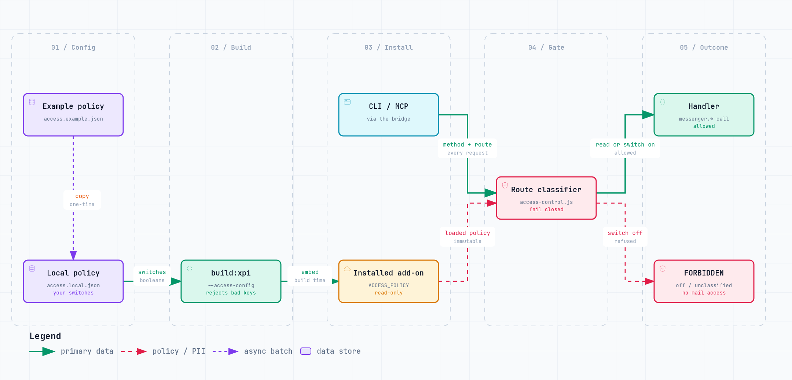

# Access control

The add-on enforces one installation-wide access policy for every caller — CLI, MCP, and
direct bridge requests. The policy is embedded in the XPI at build time; no client can change
it at runtime.

Every request is classified in `extension/src/access-control.js`. A request whose route isn't
recognized there is refused (`FORBIDDEN: unclassified operation ...`) rather than silently
allowed, so a handler added to `background.js` without a matching access-control entry fails
closed instead of shipping unrestricted.

| Key | Default | What it allows |
|---|---|---|
| `downloadAttachments` | `true` | Downloading attachment content (`tb attachment-download`, MCP `email_attachments operation=download`) |
| `compose` | `true` | Creating a draft via `tb compose`/`tb reply`/`tb forward`, or editing one via `tb edit` |
| `send` | `true` | Sending immediately with `--send` (requires `compose: true`) |
| `move` | `true` | `tb move`, `tb bulk move` |
| `copy` | `true` | `tb copy` |
| `archive` | `true` | `tb archive` |
| `delete` | `false` | `tb delete` (to Trash and `--permanent`), `tb bulk delete`, MCP `email_archive operation=delete` |
| `mark` | `true` | `tb mark` (read/flagged/junk) |
| `tag` | `true` | Tagging a message (`tb tag`), `tb bulk tag` |
| `tagCreate` | `true` | Creating a new tag definition |
| `folderCreate` | `true` | `tb folder-create` |
| `folderRename` | `true` | Renaming a folder |
| `folderDelete` | `false` | `tb folder-delete` (removes the folder and potentially its contents) |
| `contactsWrite` | `false` | `tb contacts create`/`tb contacts update`, MCP `contact_create`/`contact_update` |
| `calendarWrite` | `false` | `tb calendar create`/`update`/`delete`, MCP `calendar_event_create`/`calendar_event_update`/`calendar_event_delete` |
| `tasksWrite` | `false` | `tb tasks create`/`tb tasks update`, MCP `task_create`/`task_update` |

With a switch off, the route returns `FORBIDDEN: '<key>' is disabled by the add-on access
policy ...` before touching the mailbox. Routes with no switch at all (search, list, read,
stats, sync, `GET /addressbooks`, `POST /messages/:id/action-items`, `POST
/messages/:id/event-draft`, `POST /extension/reload`, ...) are always available — the policy
only gates operations that create, mutate, or send. The last two are deterministic,
non-mutating text extraction (candidate action items / an event draft parsed from the message
body), same as read routes. Bridge-local endpoints (`/bridge/status`, `/bridge/events`) never
reach the add-on, so the policy doesn't apply to them.

`delete` and `folderDelete` default off: the board decided (ODIAA-2304) that deletion stays
gated rather than removed from the extension entirely. Every write switch that predates
ODIAA-2306 defaults on, so an unmodified install behaves exactly as before this policy
existed; operators who want a more restrictive posture set the switches they want to disable
in their config file. `contactsWrite`, `calendarWrite`, and `tasksWrite` are the exception:
like `delete`/`folderDelete`, new *write* switches default off (opt-in), matching atbridge's
off-by-default write posture — enable them explicitly to let `tb contacts create`/`tb
contacts update`, `tb calendar create`/`update`/`delete`, or `tb tasks create`/`tb tasks
update` (or the equivalent MCP tools) mutate an address book, a calendar, or a task.

## How a request is checked

<a href="diagrams/access-control.html"><picture>
  <source media="(prefers-color-scheme: dark)" srcset="diagrams/access-control-dark.png">
  
</picture></a>

Source: [`diagrams/src/access-control.json`](diagrams/src/access-control.json). Click the image for the interactive version.

## Enable/disable capabilities

1. Copy `access.example.json` to `access.local.json` (ignored by Git).
2. Set the switches you want to change.
3. Run `npm run build:xpi -- --access-config access.local.json`.
4. Install the built XPI (Add-ons Manager → ⚙️ → Install Add-on From File). Thunderbird asks to
   approve the `messagesDelete` permission only when `delete` is enabled.
5. Check the **loaded** add-on's policy: `tb access` (or
   `curl -H "Authorization: Bearer $TB_AUTH_TOKEN" http://127.0.0.1:7700/access`). Restarting
   Thunderbird is not required, but a running Thunderbird instance must reload the add-on (or be
   restarted) to pick up a newly installed XPI.

Editing the JSON alone changes nothing: the builder validates it, writes it into
`src/access-config.js` inside the XPI, and derives the manifest's permissions from it. Unknown
keys, non-boolean values, invalid JSON, and `send: true` without `compose: true` all fail the
build. Without `--access-config`, the source defaults above are used.

## Boundaries

- Enabling a switch is not authorization for an AI agent to use it; agents must still get
  explicit user approval for consequential actions (see `skills/thunderbird-cli/SKILL.md`).
- This is add-on-level policy, not authentication or transport security — it does not replace
  bridge authentication (`TB_AUTH_TOKEN`) or OS-level protections.
- Previously installed or signed XPIs predate this policy and still allow everything; install a
  new build to get it.
- The Fast Actions (`tb email-to-*`, the equivalent MCP tools, and the "Save to Notes"/"Create
  Task"/"Create Event"/"Add Sender to Contacts" context-menu items — ODIAA-2333) are composites
  over existing routes and introduce no new write switch: `email-to-task`/"Create Task" and
  `email-to-event`/"Create Event" are gated by `tasksWrite`/`calendarWrite` at `/tasks/create`
  and `/calendar/events/create` respectively, `email-to-contact`/"Add Sender to Contacts" by
  `contactsWrite` at `/contacts/create`, and `email-to-note`/"Save to Notes" needs no switch
  because it never mutates Thunderbird state — it only writes to the local notes workspace.
